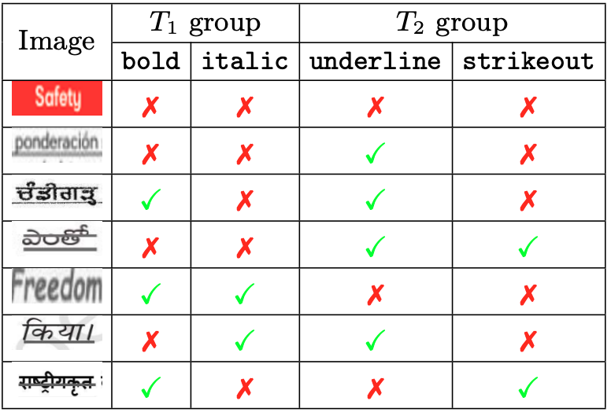
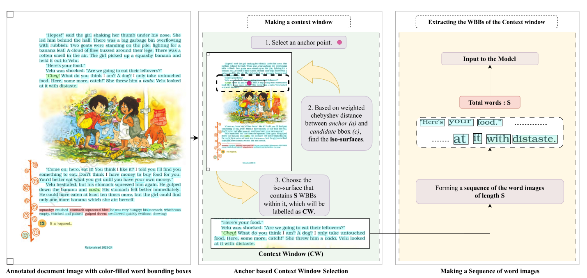
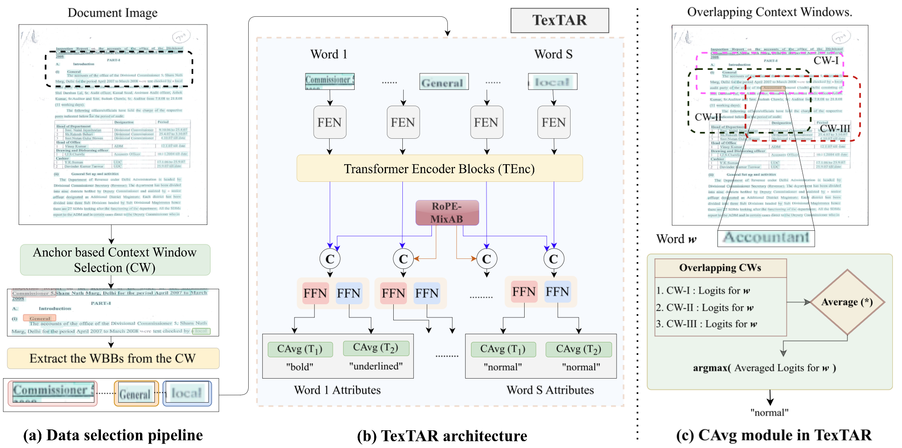
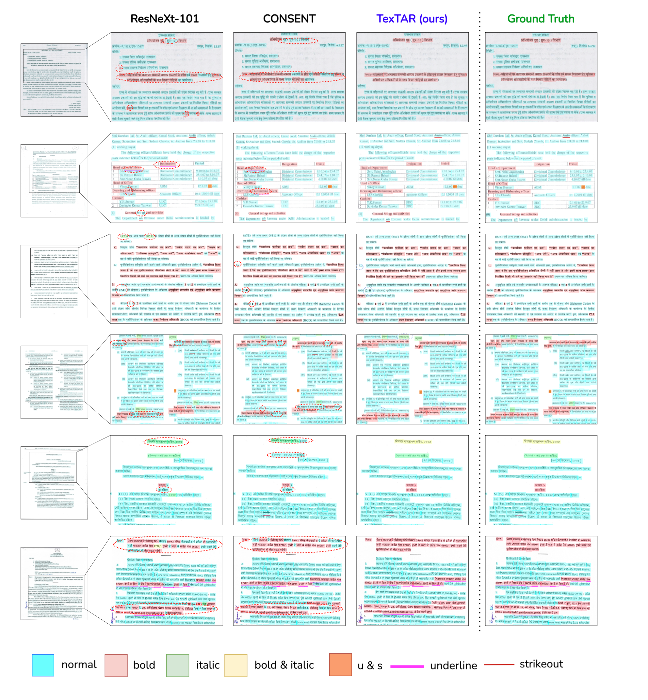

<div align="center">

<samp>
<h1> TexTAR  </h1>
<h2> Textual Attribute Recognition in Multi-domain and Multi-lingual Document Images </h2>
</samp>

**Accepted at ICDAR 2025**

| **[ [```Paper```](https://your-paper-link.example.com) ]** | **[ [```Website```](https://tex-tar.github.io/) ]** |
|:-----------------------------------------------------------:|:---------------------------------------------------------------:|

</div>

---

## Table of Contents

1. [Getting Started](#getting-started)
2. [Project Overview](#project-overview)
3. [Outputs](#outputs)
4. [Evaluation & Inference](#evaluation-inference)
5. [Visualization of Results](#visualization-of-results-for-a-subset-of-baselines-and-variants-in-comparison-with-textar)
6. [Download Dataset & Weights](#download-dataset-weights)
7. [Citation](#citation)
8. [Contact](#contact)

---

# Getting Started

```bash
To make the code run, install the necessary libraries 
python3 -m venv .textar
pip install -r requirements.txt
```

# Project Overview

Recognizing textual attributes such as **bold**, *italic*, <u>underline</u>, and ~~strikeout~~ is essential for understanding text semantics, structure, and visual presentation. These attributes highlight key information—making them crucial for document analysis.  

We introduce **TexTAR**, a multi-task, context-aware Transformer for Textual Attribute Recognition (TAR), capable of handling both positional cues (bold, italic) and visual cues (underline, strikeout) in noisy, multilingual document images. To support this, we also release **MMTAD**, a diverse, multilingual, multi-domain dataset annotated with these text attributes across real-world documents (legal records, notices, textbooks).  
Predicting attributes from isolated word crops can be ambiguous—for instance, a table row separator may mimic an underline—so we introduce a novel, efficient data-selection pipeline to extract neighborhood context via fixed-length context windows.

<div align="center">
  

### Attribute Groups

- **T1 group**  
  `{ normal, bold, italic, bold & italic }`

- **T2 group**  
  `{ normal, underline, strikeout, underline & strikeout }`
Our approach features:  
1. **Fast data-selection pipeline** that extracts fixed-length context windows around each word.  
2. **2D Rotary Positional Embeddings** to fuse spatial context into the Transformer.  
3. **Multi-task heads** for simultaneous prediction of two attribute groups, yielding state-of-the-art accuracy on TAR benchmarks.


---


## 1. Data Creation Pipeline

1. **Bounding-Box Prediction**  
   We first run a text detector (e.g. Doctr) over each page image to produce word-level bounding boxes (`bbox.json`).

2. **Context-Window Generation**  
   For each detected box, we assemble a fixed-length context window by grouping its nearest neighbors in 2D space. This ensures that every crop carries both the target word and a consistent surrounding “context” of exactly *N* tokens.

These word level images are then ready for model ingestion.

<div align="center">
  
</div>


## 2. Training Strategy

We employ a **two-stage** training scheme:

**Stage 1: Base Pre-training**  
- Train the Feature Extraction Network (FEN), Transformer Encoder (TEnc) and Dual Classification Heads end-to-end on context-window crops.  
- Outcome: strong token embeddings (Temb) carrying rich visual and coarse positional cues.

**Stage 2: RoPE-MixAB Fine-tuning**  
- Freeze FEN and TEnc to preserve learned features.  
- Train the RoPE-MixAB module (and continue fine-tuning the classification heads).  
- Concatenate Temb with the RoPE-MixAB output (Trope) before the final heads, injecting precise positional information without disturbing base representations.

<div align="center">
  
</div>

# ⚙️ Configuration
- **Data Creation Pipeline**: edit `config/data_config.yaml` to adjust paths, sequence size, random crop settings, etc for extracting data to give the input to the model 
- **Model Training**: edit `config/model_config.yaml` to set learning rate, batch size, model name, datasets, optimizer, and other hyperparameters for training the model.

| Parameter                                     | Description          | Default Value                                           |
|---------------------------------------|------------------------------------------------------------------------------------------------------------------------------|---------------------------------------------------------|
| input_images                                           | Path to the folder containing source document images.                                                                        | /data/textar_inputs                                     |
| bbox_json                             | Output JSON from bounding‐box generation (maps each image to its word‐level bboxes).                                         | /data/textar_outputs/jsons/generate_bbox.json           |
| crops_json                            | Output JSON from context‐window cropping (maps each image to its context windows).                                            | /data/textar_outputs/jsons/crops.json                   |
| word_only                             | Directory where per‐word crops (after extract_cw) are saved.                                                                  | /data/textar_outputs/word_only                          |
| word_cw                               | Final directory for grouped CW folders (after image_organization).                                                            | /data/textar_outputs/word_cw                            |
| generate_json.image_folder            | Folder of raw input images for OCR/bbox predictor.                                                                           | *INPUT_IMAGES                                           |
| generate_json.output_json             | Path where bounding‐box JSON will be written.                                                                                 | *BBOX_JSON                                              |
| generate_json.batch_size              | Batch size for the OCR/bbox predictor.                                                                                        | 64                                                      |
| generate_json.device                  | Torch device for OCR (e.g. cuda:0 or cpu).                                                                                    | cuda:0                                                  |
| context_crop.bbjson                   | Path to the bbox JSON used by the context‐window generator.                                                                  | *BBOX_JSON                                              |
| context_crop.output_file_path         | Path where the context‐window definitions will be saved.                                                                     | *CROPS_JSON                                             |
| context_crop.seq_size                 | Number of tokens (words/patches) per fixed‐length context window.                                                             | 125                                                     |
| context_crop.type                     | "word" for word‐based windows or "patch" for sub‐patch windows.                                                               | word                                                    |
| extract_cw.cw_json_path               | The context‐window JSON generated in the previous step.                                                                       | *CROPS_JSON                                             |
| extract_cw.output_word_crops_path     | Directory into which each word’s final image crops will be written.                                                           | *WORD_ONLY_DIR                                          |
| image_organization.source_folder      | Source folder of all extracted word images to re‐group per CW.                                                               | *WORD_ONLY_DIR                                          |
| image_organization.dest_folder        | Destination of the final context windows.                                                           | *WORD_CW_DIR 


# To run the code

### 1. Generate Data  
Run the entire data‐creation pipeline (bbox → context windows → word crops):

```bash
python3 data_pipeline.py
```

---

### 2. Inference  
1. Open **`model_config.yaml`** and set:
   ```yaml
   purpose: test
   ```  
2. Execute:
   ```bash
   python3 main.py
   ```

---

### 3. Training  

We employ a **two-stage** training strategy:

#### Stage 1 – Base Pre-Training  
1. In **`model_config.yaml`**, set:
   ```yaml
   purpose: train
   pretrained: false
   ```  
2. Launch training:
   ```bash
   python3 main.py
   ```

#### Stage 2 – RoPE Fine-Tuning  
1. After Stage 1 finishes, note your best checkpoint path (e.g. `checkpoints/best.pt`).  
2. In **`model_config.yaml`**, update:
   ```yaml
   purpose: train
   pretrained: "checkpoints/best.pt"
   ```  
3. Fine-tune:
   ```bash
   python3 main.py
   ```

---

# Outputs
After running the full dataset pipeline. you should see something like 
/data/textar_outputs/
```bash
├── jsons/
│   ├── generate_bbox.json      ← word-bbox outputs
│   └── crops.json              ← context-window definitions
├── word_only/                  ← raw word-context patches
│   ├── 0-0_001.png_0_CW_4_0.png
│   ├── 0-0_001.png_1_CW_4_0.png
│   └── …
└── word_cw/                    ← patches grouped by context-window ID
├── 0/
│   ├── 0-0_001.png_0_CW_0_0.png
│   └── …
├── 1/
│   ├── 0-0_001.png_2_CW_1_0.png
│   └── …
└── 4/
├── 0-0_001.png_0_CW_4_0.png
└── …

```
After inference , the output will be a json file where it contains all the predictions of the words which are in the image . So you should see something like 
```bash
{
  "001.png": [
    {
      "bb_dim": [169, 83, 198, 99],
      "bb_ids": [
        {
          "id": 0,
          "ocrv": "FIG.",
          "attb": {
            "no_bi": false,
            "bold": false,
            "italic": true,
            "b+i": false,
            "no_us": true,
            "underlined": false,
            "strikeout": true,
            "u+s": false
          }
        }
      ]
    },
    {
      "bb_dim": [198, 84, 216, 98],
      "bb_ids": [
        {
          "id": 1,
          "ocrv": "34",
          "attb": {
            "no_bi": true,
            "bold": false,
            "italic": false,
            "b+i": false,
            "no_us": false,
            "underlined": true,
            "strikeout": false,
            "u+s": false
          }
        }
      ]
    }
    // … more word entries …
  ]
}

```

# Evaluation & Inference

- **Metric:** We use the F1-score to balance precision and recall, making it robust to the natural class imbalance in attributes like bold, italic, underline, and strikeout.  
- **Inference Pipeline:** At test time, each image goes through our two-stage pipeline (bbox detection → context-window generation → model prediction). The model’s per-word attribute outputs are compared against ground truth using the F1 metric to quantify recognition performance.                                  

<!-- # Visualization of results for a subset of baselines and variants in comparison with TexTAR
<div align="center">
  
</div> -->

# Download Dataset & Weights

Model weights and the MMTAD testset can be downloaded from the [link]("https://zenodo.com). To get access to the full dataset, please contact [Dr. Ravi Kiran Sarvadevabhatla](mailto:ravi.kiran@iiit.ac.in.)


# Citation
Please use the following BibTeX entry for citation .
```bibtex
@article{Kumar2025TexTAR,
  title   = {TexTAR: Textual Attribute Recognition in Multi-domain and Multi-lingual Document Images},
  author  = {Rohan Kumar and Jyothi Swaroopa Jinka and Ravi Kiran Sarvadevabhatla},
  booktitle = {International Conference on Document Analysis and Recognition,
            {ICDAR}},
  year    = {2025}
}


```
# Contact
For any queries, please contact [Dr. Ravi Kiran Sarvadevabhatla](mailto:ravi.kiran@iiit.ac.in.)


